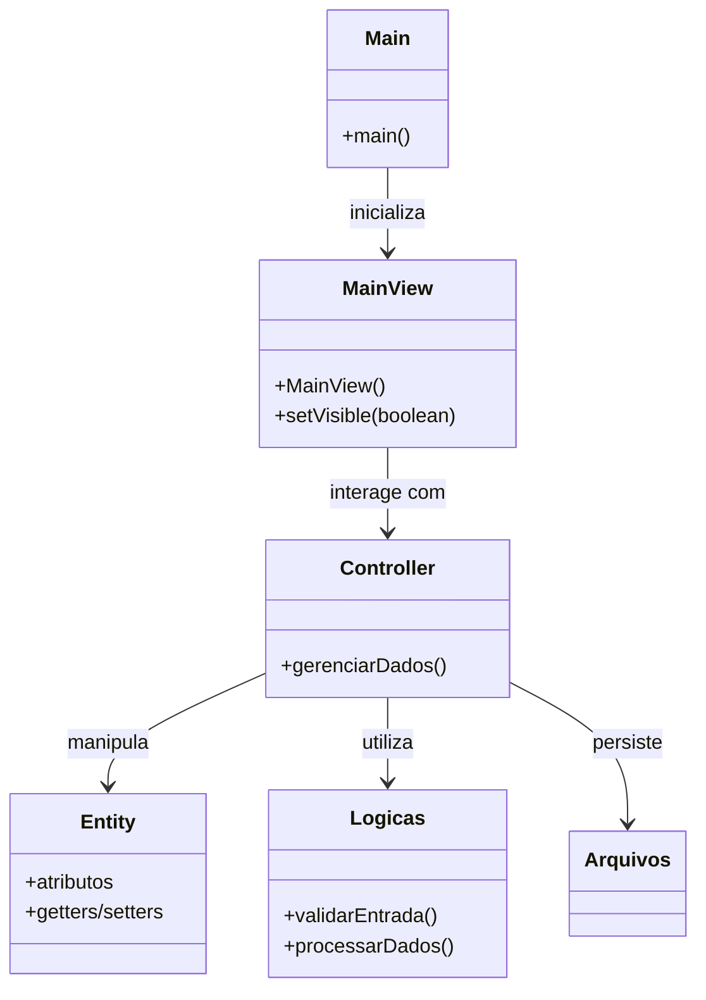

# 🚜 Ranch System: Sistema de Gestão Rural

## 🌟 Status do Projeto

[](https://www.java.com/pt-br/)
[](https://maven.apache.org/)
[](https://docs.oracle.com/javase/8/docs/api/javax/swing/package-summary.html)
[](https://github.com/google/gson)
[](https://en.wikipedia.org/wiki/Desktop_application)
[](LICENSE)

## 🎯 Visão Geral do Projeto

Bem-vindo ao **Ranch System**, uma solução de software inovadora e robusta, meticulosamente desenvolvida em Java para revolucionar a gestão de propriedades rurais. Este sistema desktop foi concebido para ser o pilar da eficiência operacional em fazendas modernas, oferecendo um controle sem precedentes sobre os pilares fundamentais de qualquer empreendimento rural: **funcionários, rebanhos, plantações e finanças**.

Com uma interface gráfica intuitiva e responsiva, construída com o poder do Java Swing, o Ranch System transforma complexas tarefas administrativas em processos simplificados e acessíveis. Nosso objetivo é capacitar gestores rurais a tomar decisões estratégicas baseadas em dados precisos e atualizados, impulsionando a produtividade e a sustentabilidade de suas operações. Prepare-se para uma gestão rural inteligente e integrada!

## 🏛 Arquitetura e Design de Software

O Ranch System adota uma arquitetura inspirada no padrão **Model-View-Controller (MVC)**, adaptada para aplicações desktop em Java Swing. Essa abordagem promove a separação de responsabilidades, facilitando a manutenção, escalabilidade e testabilidade do código. A persistência de dados é realizada através de arquivos JSON, utilizando a biblioteca Gson para serialização e desserialização de objetos.

### Estrutura de Diretórios e Pacotes

A organização dos diretórios e arquivos do projeto é intuitiva, facilitando a navegação e o entendimento do código:

```
Ranch_System/
├── RanchSystem/                  # Diretório raiz do projeto Maven
│   ├── Arquivos/                 # 🗄 Armazena os arquivos JSON para persistência de dados
│   │   ├── despesas.json         # Dados financeiros
│   │   ├── funcionarios.json     # Dados dos funcionários
│   │   ├── gados.json            # Dados do rebanho
│   │   └── plantacoes.json       # Dados das plantações
│   ├── src/                      # Código fonte da aplicação
│   │   └── main/
│   │       └── java/
│   │           └── br/
│   │               └── com/
│   │                   └── RanchSystem/
│   │                       ├── Controller/       # 🧠 Lógica de controle e manipulação de dados (CRUD, validações)
│   │                       ├── Entity/           # 📦 Classes de entidade (modelos de dados do domínio)
│   │                       ├── Logicas/          # ⚙️ Classes com lógicas de validação e regras de negócio específicas
│   │                       └── View/             # 🖥 Classes da interface gráfica (Java Swing) e interação com o usuário
│   ├── pom.xml                   # ⚙️ Arquivo de configuração do Apache Maven (dependências, plugins, build)
│   └── target/                   # 📦 Diretório de saída do build (JARs compilados, classes, etc.)
├── LICENSE                       # ⚖️ Arquivo de licença do projeto (MIT License)
└── README.md                     # 📄 Este documento detalhado do projeto
```

### Diagrama de Classes (Simplificado)

Para ilustrar a interação entre os principais componentes, apresentamos um diagrama de classes simplificado em Mermaid:



### Fluxo de Execução

1.  **Inicialização:** A aplicação é iniciada através da classe `Main`, que invoca a `MainView` em uma *thread* segura para GUI (`SwingUtilities.invokeLater`).
2.  **Interface do Usuário:** A `MainView` (e outras classes no pacote `View`) constrói e exibe a interface gráfica, permitindo a interação do usuário.
3.  **Interação e Controle:** As ações do usuário na GUI são capturadas e delegadas às classes no pacote `Controller`.
4.  **Lógica de Negócio:** Os `Controllers` orquestram as operações, utilizando as `Entities` (modelos de dados) e as `Logicas` (regras de negócio e validações) para processar as informações.
5.  **Persistência de Dados:** Os dados são salvos e carregados de arquivos JSON localizados no diretório `Arquivos/`, garantindo a persistência das informações entre as sessões.

## ✨ Funcionalidades Essenciais

O Ranch System integra um conjunto de módulos poderosos, cada um projetado para atender às necessidades específicas da gestão de uma fazenda:

*   **Gestão de Funcionários:** Cadastro, edição, exclusão e consulta de informações de colaboradores.
*   **Controle de Rebanho:** Registro detalhado de animais, incluindo dados de saúde, alimentação e movimentação.
*   **Administração de Plantações:** Gerenciamento de culturas, ciclos de plantio, colheita e insumos.
*   **Controle Financeiro:** Registro de despesas e receitas, permitindo uma visão clara da saúde financeira da propriedade.
*   **Persistência de Dados:** Todos os dados são armazenados localmente em arquivos JSON, garantindo a segurança e a disponibilidade das informações.
*   **Interface Gráfica Intuitiva:** Desenvolvida com Java Swing para uma experiência de usuário amigável e eficiente.

## 🛠 Dependências

O projeto utiliza as seguintes dependências:

*   **Gson (com.google.code.gson:gson:2.10.1)**: Biblioteca Java para serialização e desserialização de objetos Java para JSON e vice-versa. Essencial para a persistência de dados.

## ⚙ Pré-requisitos

Para compilar e executar o Ranch System, você precisará ter instalado:

*   **Java Development Kit (JDK)**: Versão 17 ou superior. Baixe em [site oficial da Oracle](https://www.oracle.com/java/technologies/downloads/).
*   **Apache Maven**: Versão 3.x ou superior. Baixe em [site oficial do Maven](https://maven.apache.org/download.cgi).

## 🚀 Instalação e Execução

Siga os passos abaixo para configurar e executar o projeto em sua máquina local:

### 1. Clonagem do Repositório

Abra seu terminal ou prompt de comando e execute:

```bash
git clone https://github.com/GilvanPedro/Ranch_System.git
cd Ranch_System/RanchSystem
```

### 2. Compilação do Projeto

Navegue até o diretório `RanchSystem` e compile o projeto usando Maven:

```bash
mvn clean install
```

Este comando irá baixar as dependências, compilar o código e empacotar a aplicação em um arquivo JAR executável no diretório `target/`.

### 3. Execução da Aplicação

Após a compilação, você pode executar a aplicação a partir do terminal:

```bash
java -jar target/RanchSystem-1.0-SNAPSHOT.jar
```

**Nota:** Certifique-se de que o `exempoIcon.png` esteja acessível no classpath ou no diretório de execução, caso contrário, o ícone da aplicação pode não ser carregado corretamente.

## 🖼 Interface do Sistema

Ao iniciar a aplicação, você será recebido por uma tela principal que permite navegar entre os diferentes módulos de gestão (Funcionários, Rebanho, Plantações, Despesas).

### **Dashboard (Painel Administrativo)**

O Dashboard apresenta uma visão geral da fazenda, funcionando como o painel administrativo principal do sistema. As informações são exibidas em cards visuais, permitindo ao usuário acompanhar rapidamente os principais indicadores, como total de gados, número de funcionários, plantações, saldo financeiro, área total, média iABCZ, status da fazenda e data atual. Esse modelo facilita a tomada de decisões ao concentrar dados importantes em uma única tela. O uso de cores nos valores ajuda a destacar cada métrica, tornando a leitura mais intuitiva. É uma tela focada em resumo, monitoramento e controle geral da propriedade.


---

### **Módulo de Funcionários**

Esta tela representa o módulo de gerenciamento de funcionários do RanchSystem. Nela, o usuário pode cadastrar, visualizar e administrar os dados dos colaboradores da fazenda de forma simples e organizada. A interface conta com um formulário superior para inserção de informações como nome completo, CPF, salário e telefone. Logo abaixo, uma tabela exibe todos os funcionários já cadastrados, facilitando a visualização geral e a seleção de registros. Na parte inferior, botões de ação permitem adicionar, editar, excluir e exportar os dados, tornando o fluxo de gerenciamento direto e eficiente. O layout prioriza clareza e praticidade no controle da equipe.


---

### **Módulo de Gado**

Esta tela corresponde ao módulo de cadastro e controle do gado da fazenda. O formulário permite registrar informações essenciais e zootécnicas dos animais, como nome, RGN, raça, categoria, iABCZ, proprietário, sexo e dados de nascimento. A separação clara dos campos ajuda a manter a organização e reduz erros no cadastro. Abaixo do formulário, uma tabela lista os animais registrados, possibilitando consulta rápida e ações diretas sobre cada registro. Assim como nos outros módulos, há botões para adicionar, editar, excluir e exportar os dados, reforçando a padronização da interface e a facilidade de uso.


---

### **Módulo de Plantações**

Esta tela representa o módulo de gerenciamento de plantações do RanchSystem. O sistema permite registrar e acompanhar os cultivos realizados na fazenda de forma organizada e prática. Na parte superior, há um formulário para cadastro das informações principais da cultura, como tipo de cultivo, área em hectares e indicação do uso de agrotóxicos.

Abaixo, uma tabela apresenta os registros já cadastrados, exibindo dados como cultura, área plantada, data de plantio, colheita prevista e uso de defensivos agrícolas. Esse formato facilita o acompanhamento do ciclo produtivo e o planejamento agrícola da propriedade. Na parte inferior, os botões de ação possibilitam adicionar, editar, excluir e exportar os dados, mantendo o padrão visual e funcional dos demais módulos do sistema.


---

### **Módulo Financeiro**

Esta tela corresponde ao módulo de movimentação financeira do RanchSystem, responsável pelo controle de ganhos e gastos da fazenda. O formulário superior permite registrar transações financeiras detalhadas, incluindo descrição, tipo da movimentação (ganho ou gasto), categoria e valor em reais.
Logo abaixo, uma tabela exibe o histórico das movimentações financeiras, apresentando informações como ID, descrição, tipo, categoria, valor e data do lançamento. Esse recurso auxilia no controle financeiro e na análise econômica da propriedade. Assim como nos outros módulos, a tela conta com botões para adicionar, editar, excluir e exportar os dados, garantindo padronização, organização e facilidade na gestão financeira.


---

## 🗺️ Roadmap: Futuro do Ranch System

O Ranch System está em constante evolução. As seguintes melhorias e expansões estão no horizonte para futuras versões, visando tornar a gestão rural ainda mais poderosa e integrada:

*   **Integração com Banco de Dados Relacional:** Migração da persistência de dados de arquivos JSON para um sistema de gerenciamento de banco de dados robusto (e.g., PostgreSQL, MySQL). Isso garantirá maior escalabilidade, integridade e capacidade de consulta de dados.
*   **Módulo de Relatórios Avançados:** Desenvolvimento de um sistema de relatórios mais dinâmico e personalizável, com opções de exportação para formatos como PDF e Excel, permitindo análises aprofundadas.
*   **Sistema de Autenticação e Autorização:** Implementação de um módulo de segurança com múltiplos usuários e níveis de acesso, ideal para equipes de fazenda com diferentes responsabilidades.
*   **Versão Web da Aplicação:** Expansão do Ranch System para uma plataforma web, utilizando tecnologias como Spring Boot para o backend e frameworks modernos de frontend (React, Angular, Vue.js), possibilitando acesso remoto e mobilidade.
*   **Monitoramento em Tempo Real (IoT):** Integração com dispositivos IoT e sensores para coletar dados em tempo real sobre condições climáticas, saúde do rebanho, umidade do solo, etc., oferecendo insights preditivos.

## 🤝 Como Contribuir

Sua contribuição é muito valiosa para o crescimento do Ranch System! Se você tem ideias, encontrou um bug ou deseja adicionar uma nova funcionalidade, siga estas diretrizes para contribuir:

1.  **Faça um Fork** do repositório para sua conta GitHub.
2.  **Crie uma Nova Branch** para sua feature ou correção: `git checkout -b feature/sua-nova-feature` ou `git checkout -b bugfix/correcao-de-bug`.
3.  **Implemente suas Alterações:** Faça as modificações necessárias, adicione testes (se aplicável) e garanta que o código esteja limpo e bem documentado.
4.  **Commit suas Mudanças:** Escreva mensagens de commit claras e descritivas: `git commit -m 'feat: Adiciona nova funcionalidade X'` ou `git commit -m 'fix: Corrige bug Y'`.
5.  **Envie para sua Branch:** `git push origin feature/sua-nova-feature`.
6.  **Abra um Pull Request (PR):** Descreva detalhadamente suas alterações, o problema que resolve e como foi testado. Estamos ansiosos para revisar sua contribuição!

## 📄 Licença

Este projeto está sob a **Licença MIT**. Para detalhes completos sobre os termos e condições, consulte o arquivo [LICENSE](LICENSE) no repositório.

## 🧑‍💻 Autor

Este projeto foi desenvolvido por [Gilvan Pedro](https://github.com/GilvanPedro).
